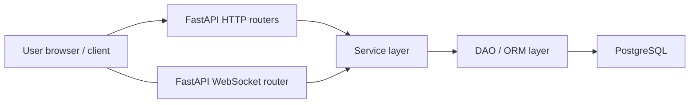

## LawAgentProject

AI-powered legal assistant for Russian housing & utilities (ЖКХ) consultations via chat.

---

## Purpose / Problem statement

The project aims to help users navigate legal questions in the Russian housing and communal services domain: 
rent, HOA, utilities disputes, billing issues, and related topics.  
Legal information in this area is fragmented across laws, bylaws, and regional acts, 
and professional legal help is not always accessible or affordable.

This service provides a chat-based AI agent that will:
- guide users through typical ЖКХ scenarios;
- help them understand their rights and obligations;
- suggest possible actions and documentation they may need (claims, complaints, requests, etc.).

At the current stage the project is an application skeleton with authentication, chat plumbing, and database layer; LLM integration and domain logic are planned.

---

## Features / Scope

### Implemented (current scope)

- **Web UI pages**
  - Landing page and chat entry point served via FastAPI templates (`index.html`).
  - Authenticated profile page with user data (`profile.html`).

- **User management**
  - Registration with email and password, server-side validation.
  - Login with JWT-based access token stored in HTTP-only cookie.
  - Logout endpoint that clears the access token.
  - View and update own profile (including password change).
  - Disable own account.

- **Chat plumbing**
  - WebSocket endpoint for real-time chat (`/ws/chat`).
  - Connection manager for handling multiple WebSocket connections.
  - Welcome message based on configurable `WELCOME_MESSAGE`.
  - Echo-style message handling as a placeholder for future AI responses.

- **Persistence layer**
  - Async PostgreSQL connection via SQLAlchemy 2.x async engine.
  - Base SQLAlchemy model with automatic timestamps (`created_at`, `updated_at`).
  - Alembic migrations configured (initial migration for user/chat/message models).

### Planned / Roadmap (legal AI scope)

- Integration with an LLM (e.g. DeepSeek) to generate legal answers in the ЖКХ domain.
- Retrieval-Augmented Generation (RAG) over a curated corpus of ЖКХ laws, by-laws, templates, and case examples.
- Smart tools for:
  - generating personalized claim/complaint/request templates;
  - guiding the user through structured flows (wizards) for typical ЖКХ disputes;
  - regional adaptations and multi-source knowledge aggregation.
- Multilingual interface (RU/EN toggle) and better UX for long workflows.

---

## Tech stack

### Current stack

- **Language**
  - Python 3.12+

- **Frameworks**
  - FastAPI (HTTP API, dependency injection, OpenAPI docs).
  - Starlette static files for serving assets.
  - Jinja2 templates for HTML pages.

- **Database & ORM**
  - PostgreSQL 17 (dockerized via `docker-compose.yml`).
  - SQLAlchemy 2.x async engine and ORM models.
  - `asyncpg` as async PostgreSQL driver.
  - Alembic for database migrations.

- **Auth & security**
  - JWT tokens using `pyjwt`.
  - Password hashing with `bcrypt` (configurable rounds).
  - Pydantic v2 models and Pydantic Settings for validated config.

- **Tooling**
  - `mypy` with Pydantic plugin for static type checking.
  - `pytest` and `httpx` (planned) for automated tests.
  - `uvicorn` as the ASGI server.

### Future / planned technologies

- **LLM & reasoning**
  - DeepSeek API integration as primary LLM provider.
  - Retrieval-Augmented Generation (RAG) for grounding answers in ЖКХ-specific documentation.

- **Vector search / data layer**
  - Faiss for vector similarity search over legal documents and templates.

- **Storage**
  - S3-compatible object storage (Amazon S3 or MinIO) for:
    - document corpora (laws, templates, examples),
    - user-uploaded documents (planned).

- **CLI & ops**
  - `click`-based management commands for:
    - migrations/maintenance,
    - index building for RAG,
    - admin/ops tasks.

---

## Project structure

High-level project tree (simplified):

```text
.
├── README.md
├── pyproject.toml
├── uv.lock
├── docker-compose.yml
├── alembic.ini
└── app/
    ├── __init__.py
    ├── main.py
    ├── config.py
    ├── database.py
    ├── alembic/
    │   ├── env.py
    │   ├── README
    │   ├── script.py.mako
    │   └── versions/
    │       └── 72fca4c6f62e_create_user_chat_message.py
    ├── api/
    │   ├── chat_router.py
    │   ├── pages_router.py
    │   └── users_router.py
    ├── dao/
    │   ├── base_dao.py
    │   └── users_dao.py
    ├── dependencies/
    │   ├── base_dependencies.py
    │   ├── chats_dependencies.py
    │   └── users_dependencies.py
    ├── models/
    │   └── models.py
    ├── schemas/
    │   ├── chats_schema.py
    │   ├── config_schema.py
    │   ├── dependencies_schema.py
    │   ├── services_schema.py
    │   └── users_schema.py
    ├── services/
    │   ├── chats_services.py
    │   └── users_services.py
    ├── static/
    │   ├── css/
    │   │   └── styles.css
    │   └── scripts/
    │       └── scripts.js
    └── templates/
        ├── index.html
        └── profile.html
```

---

## How to run (Local setup)

This section is under active development.  
Local setup and run instructions will be documented here later.

At this stage you will most likely:
- start Postgres via `docker-compose.yml`,
- apply Alembic migrations,
- run the FastAPI app with `uvicorn app.main:app --reload`.

Exact commands and recommended workflows will be documented once the runtime is stabilized.

---

## Configuration

Application configuration is managed via Pydantic Settings (`app.config.Settings`) and environment variables loaded from a `.env` file.

### Environment variables

From `DatabaseSettings`:
- `DB_HOST` – database host.
- `DB_PORT` – database port (validated to be in range 1–65535).
- `DB_NAME` – database name.
- `DB_USER` – database user.
- `DB_PASSWORD` – database password.

From `AuthSettings`:
- `SECRET_KEY` – secret key for JWT, must be at least 32 characters long.
- `ALGORITHM` – JWT algorithm.
- `ROUNDS` – bcrypt cost factor (validated to be between 4 and 31).

Additional settings:
- `WELCOME_MESSAGE` – optional welcome phrase sent via WebSocket when the user connects (default: `"Hello! How can I help you?"`).

### `.env.example`

Create a `.env` file in the project root based on the following template:

```bash
# PostgreSQL database
DB_HOST=
DB_PORT=
DB_NAME=
DB_USER=
DB_PASSWORD=

# Auth / security
SECRET_KEY=
ALGORITHM=
ROUNDS=

# Application
WELCOME_MESSAGE=
```

Pydantic will validate the configuration on startup and raise errors if required variables are missing or invalid.

---

## Architecture overview

### Layers

- **API layer (`app/api`)**
  - `chat_router.py`: WebSocket endpoint for `/ws/chat`.
  - `pages_router.py`: HTML pages (`/`, `/profile`) rendered via Jinja2 templates.
  - `users_router.py`: user registration, login, logout, profile management.

- **Service layer (`app/services`)**
  - `chats_services.py`: connection management and chat-related logic.
  - `users_services.py`: authentication, password hashing, token creation.

- **Data access layer (`app/dao`, `app/models`, `app/database`)**
  - `database.py`: async engine, session maker, base SQL model with timestamps.
  - `models.py`: SQLAlchemy ORM models (users, chats, messages, etc.).
  - `dao/`: data access helpers (e.g. `UserDAO`).

- **Schemas / DTOs (`app/schemas`)**
  - Pydantic models for requests, responses, and internal DTOs:
    - user registration/login/update DTOs;
    - chat message DTOs;
    - service-level DTOs for WebSocket messages;
    - config DTOs for auth settings.

- **Configuration (`app/config`)**
  - Pydantic Settings for:
    - database connection URL construction;
    - auth-related configuration (secret, algorithm, bcrypt rounds).

- **Migrations (`app/alembic`)**
  - Standard Alembic environment and migration scripts.

### Data flow (simplified)



In the future, the service layer will also call:
- LLM client(s) (DeepSeek and others) for answer generation;
- RAG subsystem backed by Faiss and S3/MinIO for grounded retrieval.

---

## Development flow

### Type checking

- Run `mypy` with the Pydantic plugin (configured in `pyproject.toml`) to ensure type-safety across the codebase.

### Formatting & linting

- Dedicated formatters/linters (e.g. `black`, `ruff`) are not yet configured.  
  They are recommended for future iterations but currently **TBD**.

### Database migrations

- Migrations are handled by Alembic (config via `alembic.ini` and `app/alembic`).
- Typical commands (to be adapted to your workflow):
  - `alembic revision --autogenerate -m "description"` – generate a migration.
  - `alembic upgrade head` – apply all pending migrations.

### Git workflow / pre-commit

- Suggested (but not enforced) workflow:
  - feature branches from `main`,
  - pull requests with code review before merging.
- `pre-commit` hooks are not yet configured and can be added later for:
  - formatting,
  - static analysis,
  - security checks.

---

## Testing

Testing is planned but not yet fully implemented.

- **Planned tools**
  - `pytest` as the main test runner.
  - `httpx` async client for API integration tests.
  - Factories/fixtures for database-related tests (e.g. using async test DB).

- **Status**
  - No official test suite is currently shipped with the project.
  - Tests and coverage targets will be added as the application stabilizes.

- **How to run (planned)**
  - From the project root:
    ```bash
    pytest
    ```
  - Test database config and further details will be documented later.

---

## Deployment


### Environments

Planned environment split:
- `local` – development on a single machine / Docker.
- `dev` – shared development environment.
- `stage` – pre-production testing.
- `prod` – production deployment.

### CI/CD

- CI/CD is **not configured yet**.
- Likely candidates:
  - GitHub Actions,
  - GitLab CI,
  - or any other pipeline capable of:
    - running tests and type checks,
    - building and pushing Docker images,
    - deploying to the chosen environment.

---

## Monitoring & logging

### Current state

- Relies on standard FastAPI/Starlette and `uvicorn` logging facilities.
- No dedicated metrics or observability stack is configured yet.

### Planned

- **Metrics**
  - Prometheus scraping of application metrics.
  - Grafana dashboards for request latency, error rates, DB metrics, etc.

- **Error tracking**
  - Sentry or similar service for capturing exceptions and performance data.

- **Tracing**
  - Optional OpenTelemetry-based tracing across API, service, and DB layers.

All of the above are roadmap items and not yet implemented in the current codebase.

---

## Security notes

### Secrets & configuration

- All sensitive values (DB credentials, JWT secrets, etc.) must be stored in:
  - environment variables,
  - `.env` files that are **not** committed to VCS.
- `SECRET_KEY` must be long and random (≥ 32 characters).
- Bcrypt `ROUNDS` should be set high enough for security but still performant for your environment.

### Authentication

- JWT-based authentication is planned / partially implemented:

### Data access

---

## Roadmap / TODO

High-level roadmap items:

- Integrate DeepSeek (or other LLMs) for ЖКХ-specific legal consultations.
- Implement RAG pipeline on top of Faiss and S3/MinIO-stored documents.
- Finalize authentication flow:
  - registration and verification flows,
  - password reset / recovery,
  - roles and permissions.
- Build a fully-featured chat UX:
  - message history,
  - conversation references to documents,
  - multi-step wizards for typical ЖКХ problems.
- Add automated test suite and coverage targets.
- Set up CI/CD pipelines for linting, tests, and deployment.
- Introduce monitoring, logging, and alerting for production.

---

## Author

- Name: srt-2000  
- Email: srt2000888@gmail.ru

